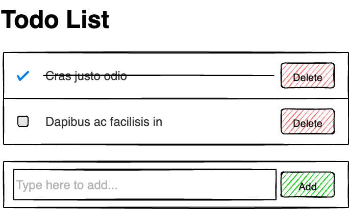
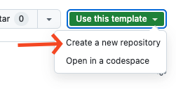

# InboxDesign Exercise Project

Please create the following features using TypeScript.

## Backend

  Use the dummy API. [https://dummyjson.com/docs/todos](https://dummyjson.com/docs/todos)

## Frontend

> **‼️ All of the following features will NEED to send HTTP request to the API endpoints. Please read the requirement carefully.**

1. Load the todo list 

   [https://dummyjson.com/docs/todos#todos-user](https://dummyjson.com/docs/todos#todos-user)

   For your convenience, user id `100` has initial data.

2. Add items

   [https://dummyjson.com/docs/todos#todos-add](https://dummyjson.com/docs/todos#todos-add)

3. Complete items

   [https://dummyjson.com/docs/todos#todos-update](https://dummyjson.com/docs/todos#todos-update)

4. Delete items

   [https://dummyjson.com/docs/todos#todos-delete](https://dummyjson.com/docs/todos#todos-delete)

## Notes

- `POST`, `PUT` and `DELETE` requests will not affect the dummy API data. Use the state management to simulate the front-end results when the API returns successful results.

- All actions should have clear feedbacks and error handling.

- Use `axios` to handle http requests. Or choose whatever packages you feel comfortable with.

- `Bootstrap@5.3.x` is included in the HTML. Feel free to use any front-end frameworks that you feel comfortable with.

- API data type declarations are defined in `src/types`.

## How to start? 

1. Go to [https://github.com/InboxDesignNZ/inboxdesign-exercise-react-ts](https://github.com/InboxDesignNZ/inboxdesign-exercise-react-ts). Create a new repository in your Github account.

    

1. Clone your repository to your computer.

2. We have initiated the project using `vite` and tested running on our dev environments. Please make sure that `node@20.19.x` and `yarn` are installed.

3. Execute `yarn` to install dependencies. Execute `yarn dev` to run the project.

>  Before you start coding, you can spend your time to setup the dev environment and get prepared. Once you start coding, you should finish it within **⏳ 1.5 hours**.